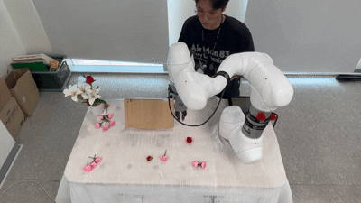
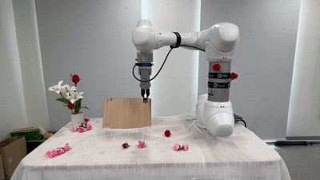
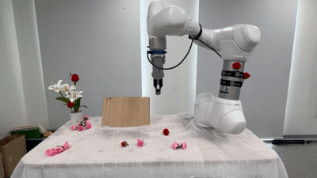

# 🌸 Rokey_Cobot: Drawing Flower Project
**두산 로봇 ROKEY Boot Camp 7기 B-3조** 비주얼 센서 없이 정밀한 좌표 제어와 클라우드 연동을 통한 **협동로봇 꽃꽂이 서비스**입니다.

[🌸 drawing-flower.web.app](https://drawing-flower.web.app/) | [📋 Project Notion](https://www.notion.so/1-3429c0a50e0d8080a62ec49c508a4a99) | [🔥 Firebase Console](https://console.firebase.google.com/project/drawing-flower/overview) | [🐙 GitHub 원본 주소](https://github.com/junsu122/Rokey_Cobot)

---
# **[🎬 티저영상 보기](https://youtu.be/fTG8bLtbn_E)**
---

## 🏗️ System Architecture
본 프로젝트는 **React(Frontend) - Firebase(Cloud) - ROS2(Backend)**가 유기적으로 연결된 분산 시스템 구조를 가집니다.

### 1. Node Architecture
* **`App.jsx`**: 사용자 UI/UX 및 이미지 픽셀화 좌표 생성
* **`publisher_v4.py`**: Firebase의 명령을 ROS2 토픽(`/new_parameter`)으로 전환 (Downlink)
* **`main_controller.py`**: 로봇의 메인 동작 제어 및 FSM(Finite State Machine) 관리
* **`monitor_node_v4.py`**: 로봇 상태를 TUI로 표시하고 Firebase에 업로드 (Uplink)


### 2. Control Flow

1. **주문**: Web 앱에서 좌표 생성 → Firebase 저장
2. **중계**: Publisher 노드가 좌표 수신 → ROS2 토픽 발행
3. **실행**: 메인 노드가 좌표에 따라 로봇 이동 및 그리퍼 제어
4. **보고**: 모니터 노드가 실시간 진행률 및 HW 상태를 다시 Web으로 전송


---

## 💻 Environment & Equipment
### Operating System & Software
- **OS**: Ubuntu 22.04 LTS
- **ROS2**: Humble
- **Language**: Python 3.10, React (Vite)
- **Database**: Firebase (Firestore, Storage)

### Hardware List
- **Robot**: Doosan Robotics M0609
- **Gripper**: DH-Robotics PGE-50-26
- **Server**: Mini PC (ROS2 Humble 환경)

---

## 📦 Dependencies
프로젝트 실행을 위해 아래 라이브러리 설치가 필요합니다.

```bash
# Firebase Admin SDK
pip install firebase-admin

# TUI Monitoring Library
pip install textual
pip install textual-plotext
```

---
## 🚀 Execution Guide
패키지를 빌드한 후 아래 순서대로 노드를 실행하세요.
1. Build
```bash
colcon build
source install/setup.bash
```
2. web실행
[🌸 drawing-flower.web.app](https://drawing-flower.web.app/)
-> 웹앱에 사용된 코드를 보려면, webapp_v2/pixel-ui/src 를 확인해주세요

4. 로봇 직접 연결
```bash
ros2 launch  dsr_bringup2 dsr_bringup2_rviz.launch.py mode:=real host:=192.168.1.100 port:=12345 model:=m0609
```
4. 로봇 메인 제어 노드
```bash
ros2 run main_robot drawing_flower
```
5. 메인 제어 노드 정상 연결 후, publisher와 monitoring 코드 실행
```bash
ros2 run robot_monitoring monitor 
```
```bash
ros2 run robot_monitoring publisher 
```
6. 웹에서 그림파일 넣어서 좌표 전송
---

## ⚠️ Exception Handling
작업 중 발생할 수 있는 예외 상황에 대해 다음과 같은 대응 로직이 포함되어 있습니다.
- 상황대응 프로세스
- 1. 고객이 web상에서 일시정지 했을때
  2. 고객이 web상에서 일시정지 후 재개 했을때
  3. 고객이 web상에서 주문취소를 했을때
  4. 로봇 작업중 일정 충격이 가해져, 일시정지 되었을때 (monitoring 코드에서 'r'을 눌러서 recovery 가능)
  5. 로봇 작업중 e-stop을 누르게 되어 로봇이 일시정지 되었을때 (e-stop 해제 후, monitoring 코드에서 'r'을 눌러 recovery 가능)

---

## 🙋 내 주요 업무

### 1. [M0609 동작 제어]
> M0609 전체 플로우 동작 설정
> 1. 좌표 수신
> 2. 꽃꽂이용 꽃 집으러 가기
> 3. 꽃 꽂이 좌표 앞으로 이동
> 4. 꽃 꽂은 후, 그리퍼 오픈
> 5. 홈으로 복귀
> 6. 수신받은 좌표 만큼 반복 시행
> 7. 시행이 끝나고 홈으로 복귀 후, 완료 메세지 송신

---

### 2. [M0609 작업공간 설정]
- M0609의 작업 공간을 설정하여, 그 외의 공간에서 동작을 방지
- 로봇의 충돌 및 파괴를 예방하기 위한 공간 설정

<table>
  <tr>
    <td align="center"><b>미설정</b></td>
    <td align="center"><b>설정 후</b></td>
  </tr>
  <tr>
    <td></td>
    <td></td>
  </tr>
</table>

---

### 3. [M0609 협업공간 설정]
- M0609의 협업 공간을 설정하여, 사람과 상호작용 하는 부분을 지정
- 이 공간에서는, 최대 속력이 250mm/s로 대폭 감소
- 이 공간에서는, 충돌 감지 민감도가 대폭 상향
- 사람과의 협업에서 사람과의 충돌을 예방하기 위한 공간 설정

<table>
  <tr>
    <td align="center"><b>미설정</b></td>
    <td align="center"><b>설정 후</b></td>
  </tr>
  <tr>
    <td></td>
    <td></td>
  </tr>
</table>

---

### 4. [M0609 사용자 좌표계 설정]
- M0609의 새로운 좌표계를 생성하여, 사람이 봤을때 좌표가 직관적일 수 있도록 지정
- 좌표계가 기울어져 있을때 x,y,z와 roll,pitch,yaw 값을 모두 계산하지 않고 평면처럼 계산 가능

<table>
  <tr>
    <td align="center"><b>기본 좌표계</b></td>
    <td align="center"><b>사용자 좌표계</b></td>
  </tr>
  <tr>
    <td></td>
    <td></td>
  </tr>
</table>

---

### 5. [GitHub 버젼 관리]
- GitHub에서 전체적인 패키지와 모듈을 관리
- 기존 메인 코드를 변경하기 전, 버젼으로 묶어서 관리

---

### 6. [코드 전체 통합]
- 구현이 완료된 코드를 받아서 동작을 확인하고 수정
- 동작이 확인된 코드는 여러번의 테스트를 통해 최적의 성능을 낼 수 있도록 조정

---

## 🔧 Trouble Shooting

### 1. [singularity 발생]
**증상**
> 지정된 좌표로 moveL을 사용하여 관절을 움직이면, M0609가 완벽하게 일을 끝내지 못하고 정지해버림.

**원인**
> 팔을 뻗는 과정에서 최대한 멀리 뻗게끔 설정을 하여, singularity가 발생. moveL 사용시 각각의 관절이 singularity가 발생하지 않게 계산하고 동작하지 않음.

**해결 방법**
> moveJ를 통해, M0609가 singularity가 발생하지 않는 관절값들로 움직이도록 유도. waypoint를 더 찍어주어, singularity가 발생하는 경로를 지나지 않도록 유도.

<table>
  <tr>
    <td align="center"><b>문제 상황</b></td>
    <td align="center"><b>해결 후</b></td>
  </tr>
  <tr>
    <td></td>
    <td></td>
  </tr>
</table>

---

### 2. [작업시, 간섭 발생]
**증상**
> 이미 꽂아져 있는 꽃들의 꽃잎에 그리퍼가 걸리거나, 그리퍼가 꽃을 망가뜨림

**원인**
> 꽃을 꽂은 좌표는 알고 있지만, 비젼센서가 없어 꽃이 정확히 어떤 모양으로 꽂아져 있는지 알 수 없음.

**해결 방법**
> 꽃을 꽂기 전에 꽂아야 하는 좌표들을 정렬하여, z축이 낮고, x축이 큰(로봇에게서 멀고 밑에 있는) 좌표들부터 꽂도록 설정. 꽂아야 하는 좌표로 가기전에 대각선 위의 경유점을 지정하여, 꽃잎과 그리퍼가 최대한 닿지 않도록 설정.(꽃잎끼리만 닿도록 조절)

<table>
  <tr>
    <td align="center"><b>문제 상황</b></td>
    <td align="center"><b>해결 후</b></td>
  </tr>
  <tr>
    <td></td>
    <td></td>
  </tr>
</table>

---

## 🎬 전체 시연 영상

<!-- 시연 영상 링크 또는 GIF 삽입 -->
[](유튜브_또는_영상_링크)
